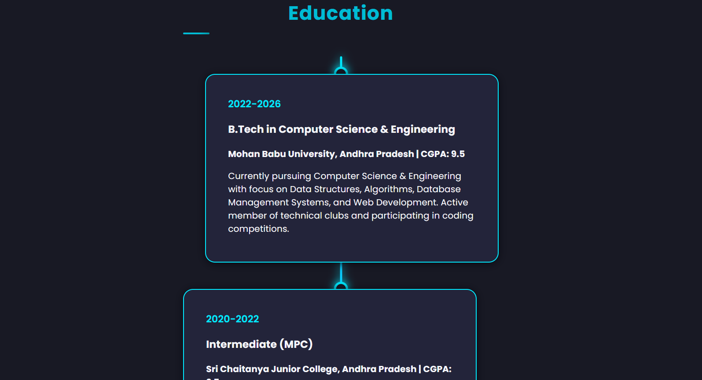

# Personal Portfolio Website

A modern, responsive personal portfolio showcasing skills, projects, and achievements with a dark theme and glassmorphism effects.

## 📸 Screenshots

### first page View

### Project view View

### Achievements view Section

### Certification Section

### Education Section

## ✨ Features

- **Modern Dark Theme** with cyan accents
- **Responsive Design** for all devices
- **Horizontal Scrolling** sections
- **Interactive Modals** for project details
- **Smooth Animations** and hover effects

## 🛠️ Tech Stack

- HTML5, CSS3, JavaScript
- Font Awesome Icons
- Google Fonts (Poppins)

## 📋 Sections

- **Hero** - Introduction with profile photo
- **Skills** - Technology icons (Java, HTML, CSS, SQL, DSA)
- **Projects** - Portfolio with modal details
- **Achievements** - Coding platforms (LeetCode, HackerRank, CodeChef)
- **Certifications** - Professional certificates
- **Education** - Academic timeline
- **Contact** - Contact form

## 🚀 Quick Start

1. Download all files
2. Open `index.html` in browser
3. Portfolio is ready to use!

## 📞 Contact

**Mogulluru Vyshnavi**  
Java and Web Developer  
Andhra Pradesh, India

---

**Built with ❤️ by Mogulluru Vyshnavi** 